## The brief

One line: "Metalyde — The OS for a Marketing Agency."

Everything below flowed from that. No spec document. No discovery phase. One line, three parallel tracks, a production-ready SaaS at the end.

## Three tracks, running in parallel

```mermaid
gantt
  title Metalyde — Three parallel tracks
  dateFormat HH:mm
  axisFormat %H:%M

  section Positioning
  Deep research + validation     :a1, 00:00, 45m
  Persona + voice + design dir   :a2, after a1, 45m

  section Engineering
  Fork boilerplate + retarget    :b1, 00:00, 30m
  Deploy to Vercel + CI green    :b2, after b1, 30m
  Dev best-practices in place    :b3, after b2, 30m

  section Audit
  Review all tracks              :c1, 01:00, 30m
  Fix gaps + solidify foundation :c2, after c1, 30m

  section Converge
  Ready to ship features         :milestone, 02:30, 0m
```

### Track 1 — Positioning

Starting from the one-line brief and our brand playbook, we ran deep web research and X/Twitter research to validate the positioning. The question was simple: is "Marketing Agency OS" a real category gap, or already owned?

The answer was clear. The category language exists; the vertical claim does not. From there we produced four positioning artifacts in sequence:

- [Positioning Exploration](https://forge.roxabi.dev/metalyde/metalyde-positioning-exploration) — category mapping, competitive landscape, the bet we are making
- [Customer Personas & Voice](https://forge.roxabi.dev/metalyde/metalyde-customer-personas) — the operator persona in detail, what they care about, what they reject
- [Brand Voice & Messaging Framework](https://forge.roxabi.dev/metalyde/metalyde-messaging-framework) — five voice attributes, headline patterns, what not to say
- [Visual Direction Exploration](https://forge.roxabi.dev/metalyde/metalyde-visual-directions) — design system direction, tone, reference points

Outcome: a coherent positioning, a defined brand voice, a sharp persona, and a design system direction — all grounded in market evidence.

### Track 2 — Engineering

In parallel, we forked our in-house SaaS boilerplate and retargeted it to Metalyde. The boilerplate is not a starter kit; it is a production-grade foundation. What that meant in practice:

- Bun + TurboRepo monorepo with TypeScript strict across all packages
- TanStack Start (web) + NestJS/Fastify (API) already wired together
- Multi-tenant PostgreSQL with Row-Level Security — tenant isolation from day one
- Better Auth with sessions and OAuth configured
- Paraglide JS for compile-time, type-safe i18n
- Shadcn/UI + CVA design tokens ready to theme
- Vitest + Playwright test infrastructure in place
- Biome formatting and linting enforced at commit

We deployed it to Vercel, confirmed CI was green on both `staging` and `main`, and declared the engineering track done. The surface was ready; no features yet, but nothing to fix either.

### Track 3 — Audit

While the other two tracks ran, we audited the full output — positioning coherence, engineering completeness, gaps between what was claimed and what was actually in place. We found two or three small things and fixed them. The project starts on solid foundations, not assumed ones.

## The result

In roughly two hours: a SaaS with a positioning, a design system, a multi-tenant backend, auth, i18n, email, and CI/CD live on Vercel. A landing page is being generated — see the [Landing Page PoC](https://forge.roxabi.dev/metalyde/metalyde-landing-poc) for the current draft. The only remaining work is shipping the product features.

## What this proves

We can take a one-line brief to a positioned, production-ready SaaS — boilerplate to design system to positioning and voice to ready-to-ship — fast, without cutting corners. The speed comes from the boilerplate and the process, not from skipping anything that matters.
