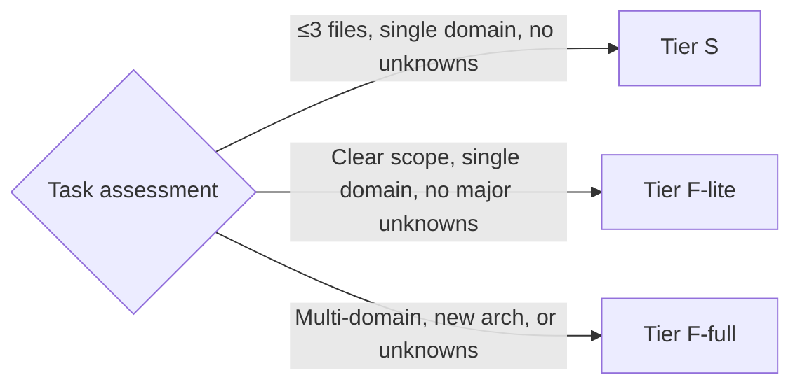
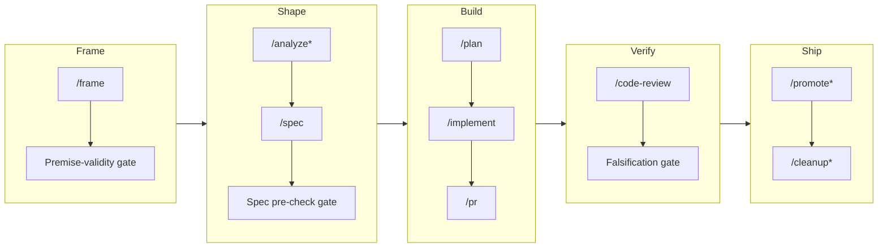

Every change to Metalyde runs through **Roxabi Plugins**, our in-house Claude Code plugin suite. The premise: every team using Claude Code ends up reinventing the same things. Roxabi Plugins are the reusable layer on top — opinionated, battle-tested skills and agents for the full development lifecycle, reading project specifics from `.claude/stack.yml` at runtime.

**dev-core** is the flagship plugin: ~30 skills, 9 agents, 3 safety hooks, one entry point.

## How we build Metalyde

Every task starts with a single command: `/dev #N`.

`/dev` scans existing artifacts, displays phase progress, detects the tier, and delegates to the right skill — resuming automatically from wherever you left off. No checklist to remember. The system drives the workflow; the human decides at every gate.

> Branch strategy: `staging` is the default integration branch. All feature and fix branches are created from `staging` and PRs target `staging`. Merges to `main` trigger Vercel production deploys. See [deployment](../guides/deployment) for details.

## Tiers

The tier is detected from issue size labels, file count, domain count, and architectural novelty. The architect agent validates; the human can override at the Frame gate.



| Tier | Criteria | What is skipped |
|------|----------|-----------------|
| **S** | ≤3 files, no new architecture, no cross-domain risk | Analyze, plan; worktree optional |
| **F-lite** | Clear scope, single domain, no major unknowns | Analyze phase — goes frame → spec → plan |
| **F-full** | Multiple domains, new patterns, or unknowns | Nothing — full pipeline runs |

File count alone does not determine the tier. A 50-file mechanical rename may be F-lite; a 3-file rate limiter with design decisions may be F-full. The architect agent validates the classification before the pipeline advances.

## The pipeline

Five phases: **Frame → Shape → Build → Verify → Ship**. Each phase produces a committed artifact and requires human approval before the pipeline advances.



`*` = conditional (skipped based on tier or outcome)

### Frame — `/frame`

`/frame` runs a 3–5 question interview and produces a frame artifact committed to `artifacts/frames/`. Before the pipeline can advance, three fields must be **concrete and falsifiable**: success in 6 months / failure in 6 months / simplest alternative. Non-falsifiable failure conditions are rejected and re-asked.

The frame is a gate skill — no advance without human sign-off.

### Shape — `/analyze` + `/spec`

For F-full, `/analyze` does deep codebase exploration (optionally in a throwaway spike worktree) and produces 2–3 mutually exclusive architectural shapes with trade-offs. F-lite skips straight to `/spec`.

`/spec` enforces a "unit tests for English" pre-check before passing: every acceptance criterion must be binary pass/fail, ambiguity budget ≤5 open items, full slice coverage. The spec is a gate skill — no advance without human sign-off.

### Build — `/plan` + `/implement` + `/pr`

`/plan` turns the approved spec into machine-readable micro-tasks, assigns each to a named agent instance (cap of ≤2 domain surfaces per instance), produces a wave structure (the parallelization graph), seeds Claude Code's task list, then recommends `/compact`.

`/implement` enters the worktree and runs **RED → GREEN → REFACTOR** — the tester writes failing tests first. A falsification gate then runs: source is stashed and each new test re-run. If a test still passes with the implementation removed, it is tautological and blocks the PR. Every spec acceptance criterion must map to a named test (SC → Test matrix).

`/pr` commits and opens the pull request.

### Verify — `/code-review`

`/code-review` spawns fresh domain-specific reviewer agents in parallel — agents that did not write the code. It runs a secret scan on the diff, checks spec compliance, and posts findings as Conventional Comments on the PR. The human chooses: fix / merge as-is / stop.

### Ship — `/promote`

After features are validated on `staging`, `/promote` batches all staging changes into a single release: computes the version, generates changelog and release notes, commits them to `staging`, and creates a PR from `staging` to `main`. Merge triggers Vercel auto-deploy. `/promote --finalize` tags the release and creates the GitHub Release.

## The agent team

9 agents, spawned as subagents via the `Task` tool. Each has a named role and stays inside its domain boundary.

| Agent | Model | Role |
|-------|-------|------|
| **architect** | Opus | System design, ADRs, tier classification, cross-domain consistency |
| **product-lead** | Sonnet | Frame → spec pipeline, backlog triage, deployed-feature verification |
| **frontend-dev** | Sonnet | UI components, routes, TanStack Start patterns |
| **backend-dev** | Sonnet | Services, controllers, data access, domain logic |
| **devops** | Sonnet | CI/CD, infra config, release tooling |
| **tester** | Sonnet | Test generation, RED phase, coverage, falsification gate |
| **fixer** | Sonnet | Targeted bug fixes within the implement loop |
| **security-auditor** | Opus | OWASP audit, CVE scan, secret detection — read-only, no Write tool |
| **doc-writer** | Sonnet | Spec reviews, API docs, READMEs |

**Shared agent invariants:**

- **Config guard** — halts if `.claude/stack.yml` is absent.
- **Confidence threshold** — confidence < ~70–80% → escalate with ≥2 options, never guess.
- **SendMessage** — agents communicate with the lead via `SendMessage`, not inline.
- **Research order** — codebase first, then context7, then web as last resort.

No agent reviews code it wrote. Review agents are fresh instances with no implementation context.

## Artifacts

Every phase commits an artifact to the repo. These serve as resumption checkpoints — `/dev` reads them on startup and skips completed phases.

| Phase | Artifact | Path |
|-------|----------|------|
| Frame | Approved frame | `artifacts/frames/{slug}.mdx` |
| Analyze (F-full) | Architectural shapes + trade-offs | `artifacts/analyses/{N}-{slug}.mdx` |
| Spec | Acceptance criteria, SC → Test matrix | `artifacts/specs/{N}-{slug}.mdx` |
| Plan | Machine-readable micro-tasks, wave structure | `artifacts/plans/{N}-{slug}.mdx` |

## Quality gates and principles

**Mechanical floor** — every change must pass before a PR is mergeable:

```
bun run lint && bun run typecheck && bun run test
```

This is the floor, not the quality bar. Output must read as hand-authored.

**TDD / RED → GREEN → REFACTOR** — the tester writes failing tests before any implementation code exists. Tests that pass without the implementation are tautological and block the PR.

**Worktree per task** — every Tier F task runs in an isolated git worktree at `.claude/worktrees/{N}-{slug}`. No code on `main` or `staging` without a worktree.

```bash
git worktree add .claude/worktrees/XXX-slug -b feat/XXX-slug staging
cd .claude/worktrees/XXX-slug && cp .env.example .env && bun install
cd apps/api && bun run db:branch:create --force XXX
```

**User is the gate** — no commit, no issue advance, no pipeline progression without human approval at gate skills (frame, spec, plan). The human decides; the system executes.

**Conventional commits** — format: `<type>(<scope>): <description>`. Types: `feat | fix | refactor | docs | style | test | chore | ci | perf`. Enforced by Commitlint on pre-push.

**Fresh review** — `/code-review` spawns new agent instances that have never seen the implementation. The security-auditor (Opus, read-only) is always included.

**Never merge with failing checks** — CI must be green. If CI fails: fix, push, wait. No exceptions.

## Why it matters

Metalyde shipped a production-grade multi-tenant SaaS in roughly 2–3 hours — not because we cut corners, but because the method is consistent and auditable. Every decision has a frame. Every acceptance criterion maps to a test. Every review comes from a fresh agent. The pipeline is the same for a one-line fix and a new billing domain.

The result: delivery velocity without accumulating hidden debt. The pipeline is not overhead — it is how we stay fast at scale.

See also: [Agent Teams Guide](../guides/agent-teams) · [Architecture Overview](../architecture)
