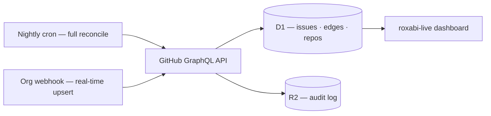

## How we track work

Every issue in the Metalyde repo flows into a single, queryable corpus. Triage happens in GitHub — labels, native relations, issue types. Status is derived, not set. The ops cockpit (roxabi-live) reads the full graph and surfaces what is blocked, what is ready, and what depends on what.

No Projects V2 board. No manual status columns. Labels + native relations only.

---

## roxabi-live — the ops cockpit

> "Operations cockpit for the Roxabi GitHub org — issue status, dependency graphs, and real-time sync."

Live at [live.roxabi.dev](https://live.roxabi.dev).

**Stack:** a single Cloudflare Worker (TypeScript, Hono) + Cloudflare D1 (serverless SQLite) + a nightly Cron Trigger + a real-time GitHub org webhook.

**Why it exists:** GitHub's default issue list and Projects give no cross-repo dependency view — no milestone x lane pivot, no dependency graph, no single queryable corpus across repos. roxabi-live fills that gap.

### Three views

| View | What it shows |
|------|---------------|
| Pivot matrix | Milestones x lanes — every open issue placed at its intersection |
| Flat list | Full corpus, filterable and searchable |
| SVG dependency graph | Nodes = issues; edges = parent/child + blocker relations; color = derived status |

### Filters

Multi-select on repo, milestone, priority, and status. Full-text search. Light/dark theme.

### Per-issue fields tracked in D1

| Field | Notes |
|-------|-------|
| `key` | Globally unique — `org/repo#number` |
| `repo`, `number`, `title`, `state`, `url` | Direct from GitHub |
| `milestone`, `lane`, `priority`, `size` | From labels |
| `status` | Derived from the dependency graph, not stored as a label |
| `has_active_branch`, `is_stub` | Lifecycle signals |

---

## How data flows

Two paths keep D1 current:



- Nightly cron: full reconcile of all org issues.
- Org webhook: incremental upsert on every issue event within seconds.
- Auth: GitHub App installation tokens, AES-GCM encrypted in D1 (no PAT).

---

## The issue lifecycle

```
Create → Triage (labels + relations) → Cockpit picks it up (webhook or cron) → Work via /dev #N → Close
```

1. **Create** — open the issue with a clear title and acceptance criteria.
2. **Triage** — set priority, size, lane, type, and any relations using `roxabi-issues:issue-triage`.
3. **Cockpit sync** — the org webhook upserts the issue into D1 within seconds; the nightly cron reconciles the rest.
4. **Work** — pick up ready issues via `/dev #N`. The dev process drives tier (S / F-lite / F-full) and the full impl lifecycle.
5. **Close** — closing the GitHub issue marks it done in the graph.

---

## Labels & types

### Priority (one per issue)

| Label | Meaning |
|-------|---------|
| `P0-critical` | Blocking — act immediately |
| `P1-high` | Important for current milestone |
| `P2-medium` | Plan for next cycle |
| `P3-low` | Backlog |

### Size / tier (one per issue)

| Label | Tier | Complexity (kappa) |
|-------|------|-------------------|
| `size:S` | S | 1–3 |
| `size:F-lite` | F-lite | 4–6 |
| `size:F-full` | F-full | 7–10 |

Complexity score: `kappa = round(files×0.20 + risk×0.25 + arch×0.25 + unknowns×0.15 + domains×0.15)`. Legacy aliases (`XS→S`, `M→F-lite`, `L/XL→F-full`) are accepted on input.

### Lane (one per issue)

`graph:lane/{lane}` where `{lane}` is one of `a1, a2, a3, b, c1, c2, c3, d..o`, or `standalone`.

### Native issue types (org-level, not labels)

`feat` | `fix` | `docs` | `test` | `chore` | `ci` | `perf` | `refactor` | `epic` | `research`

### Status — derived, not set

Status is computed from the dependency graph at read time:

- Closed issue → **done**
- Open issue with at least one open blocker → **blocked**
- Open issue with no open blockers → **ready**

Status labels (`status:Backlog`, `status:In Progress`, etc.) exist in the taxonomy but are not set by triage. The graph is the source of truth.

---

## Dependencies & hierarchy

Use **GitHub native relations** — not markdown checklists.

| Relation | Mutation | Tooling |
|----------|----------|---------|
| Parent / child (sub-issues) | `addSubIssue` GraphQL mutation | `roxabi-issues:issue-triage` |
| Blocked-by | `addBlockedBy` GraphQL mutation | `roxabi-issues:issue-triage` |

### Deferred follow-up rule

When a follow-up B is deferred from issue A: B becomes a **sibling** under the shared parent (not a child of A), and B is marked `blocked-by A` for traceability.

### Using roxabi-issues:issue-triage

The `roxabi-issues:issue-triage` skill owns all label and relation mutations. Auth via `GITHUB_TOKEN` or `gh auth token` fallback.

```bash
# List all issues; show untriaged
/issue-triage list
/issue-triage list --untriaged

# Triage an existing issue
/issue-triage set 42 --size F-lite --priority P1-high --lane a1 --type feat

# Add relations
/issue-triage set 91 --blocked-by 117
/issue-triage set 164 --parent 163
/issue-triage set 163 --add-child 164,165

# Remove relations
/issue-triage set 91 --rm-blocked-by 117
/issue-triage set 164 --rm-parent

# Create a fully triaged issue in one shot
/issue-triage create \
  --title "feat: account billing dashboard" \
  --body "Surface current plan, usage, and upcoming invoice." \
  --size F-lite --priority P1-high --lane b --type feat \
  --parent 200 --blocked-by 180
```

Key flags: `--size` `--priority` `--lane` `--type` `--blocked-by` `--blocks` `--rm-blocked-by` `--rm-blocks` `--parent` `--add-child` `--rm-parent` `--rm-child`. For `create`: also `--title` (required), `--body` (optional), `--label`.

---

## The dependency graph

roxabi-live stores edges in a D1 `edges` table keyed `(src_key, dst_key, kind)`. Two kinds: `parent` and `blocker`.

The graph endpoint (`/api/graph`) serves JSON nodes + edges. The cockpit renders it client-side as an SVG.

**Status computation per node:**

| Condition | Status |
|-----------|--------|
| Issue is closed | done |
| Issue is open AND has at least one open blocker edge | blocked |
| Issue is open AND no open blocker edges | ready |

This means sequencing is automatic: close the blocker and the dependent issue flips from blocked to ready in the next webhook upsert.

---

## Why it matters

One source of truth for every Metalyde issue. Dependency-aware sequencing without manual status management. Cross-repo visibility in a single dashboard. No Projects V2 board to maintain.

> "Labels + native relations only — no Projects V2 board."
